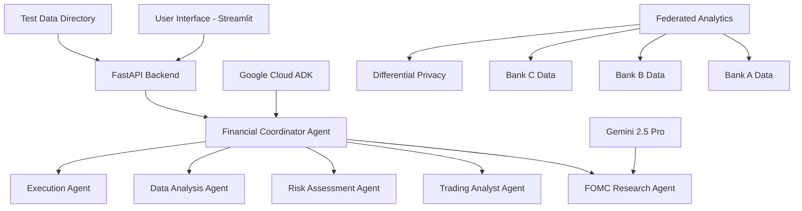

# 🏦 Federated Financial Intelligence System

## 📊 **Comprehensive AI-Powered Financial Advisory & Compliance Platform**

[](https://python.org)
[](https://fastapi.tiangolo.com)
[](https://streamlit.io)
[](https://cloud.google.com)
[](LICENSE)

---

## 🌟 **Project Overview**

This project is a cutting-edge **Federated Financial Intelligence System** that combines **Google's Agent Development Kit (ADK)**, **Federal Reserve (FOMC) monetary policy analysis**, and **personalized financial advisory services** into a unified platform. It demonstrates advanced AI concepts including federated learning, multi-agent systems, and privacy-preserving analytics for the banking and financial services industry.

### **🎯 Key Innovations**

- **🤖 Multi-Agent AI Architecture**: Specialized agents for different financial domains
- **🏛️ FOMC Integration**: Real-time monetary policy analysis combined with personal finance
- **🔗 Federated Learning Simulation**: Privacy-preserving bank collaboration
- **🛡️ RBI Compliance Engine**: Automated regulatory compliance with 8+ rules
- **📱 Modern Web Interface**: FastAPI backend + Streamlit frontend
- **🔐 Privacy-First Design**: Differential privacy and data sovereignty

---

## 🏗️ **System Architecture**



### **🔧 Core Components**

1. **🏛️ FOMC Research Agent** (`fomc_research/`)
   - Analyzes Federal Reserve monetary policy decisions
   - Processes macroeconomic and geopolitical news
   - Provides market outlook based on central bank policies

2. **💰 Financial Coordinator Agent** (`financial_advisor/`)
   - Orchestrates multiple specialist sub-agents
   - Handles user authentication and data loading
   - Integrates FOMC research with personal financial advice

3. **🔍 Sub-Agents Ecosystem**
   - **Data Analyst**: Market data analysis and ticker research
   - **Trading Analyst**: Investment strategy development
   - **Execution Analyst**: Trade execution planning
   - **Risk Analyst**: Risk assessment and management

4. **🌐 Web Interface**
   - **FastAPI Backend**: RESTful API with real-time processing
   - **Streamlit Frontend**: Interactive web dashboard
   - **Integration Layer**: Seamless agent communication

5. **📊 Federated Analytics Engine** (`init.py`)
   - Multi-bank collaboration simulation
   - Privacy-preserving data aggregation
   - RBI compliance monitoring
   - Customer segmentation and risk scoring

---

## 🚀 **Quick Start**

### **📋 Prerequisites**

- **Python 3.8+** installed
- **Google Cloud Project** with Vertex AI enabled
- **Google ADK** installed
- **Git** for cloning the repository

### **⚡ One-Command Setup**

```bash
# Clone and setup the project
git clone <repository-url>
cd agent_gcp/financial-advisor
python start_integrated_app.py
```

This will automatically:
- Install all dependencies
- Start the FastAPI backend (port 8000)
- Launch the Streamlit frontend (port 8501)
- Open your browser to the application

---

## 📥 **Detailed Installation**

### **1. Environment Setup**

```bash
# Create virtual environment
python -m venv financial_advisor_env

# Activate virtual environment
# Windows:
financial_advisor_env\Scripts\activate
# Linux/Mac:
source financial_advisor_env/bin/activate

# Upgrade pip
python -m pip install --upgrade pip
```

### **2. Install Dependencies**

```bash
# Install base requirements
pip install -r requirements.txt

# Install additional FastAPI dependencies
pip install -r requirements-api.txt
```

**Main Dependencies:**
```text
# Core Google Technologies
google-cloud-aiplatform[adk,agent-engines]>=1.95.1,<2.0.0
google-adk>=1.8.0

# Web Framework
fastapi>=0.104.0
uvicorn[standard]>=0.24.0
streamlit>=1.28.0
requests>=2.31.0

# Data Processing
pandas>=2.0.0
numpy>=1.24.0
scikit-learn>=1.3.0
plotly>=5.15.0

# Additional Tools
pydantic>=2.5.0
python-multipart>=0.0.6
python-dotenv>=1.0.0
```

### **3. Google Cloud Setup**

#### **3.1. Create Google Cloud Project**
```bash
# Install Google Cloud CLI
# https://cloud.google.com/sdk/docs/install

# Initialize and authenticate
gcloud init
gcloud auth application-default login
```

#### **3.2. Enable Required APIs**
```bash
# Enable Vertex AI and related services
gcloud services enable aiplatform.googleapis.com
gcloud services enable storage.googleapis.com
gcloud services enable secretmanager.googleapis.com
```

#### **3.3. Setup Service Account**
```bash
# Create service account
gcloud iam service-accounts create financial-advisor-agent \
    --description="Service account for Financial Advisor Agent" \
    --display-name="Financial Advisor Agent"

# Assign necessary roles
gcloud projects add-iam-policy-binding YOUR_PROJECT_ID \
    --member="serviceAccount:financial-advisor-agent@YOUR_PROJECT_ID.iam.gserviceaccount.com" \
    --role="roles/aiplatform.user"

# Create and download service account key
gcloud iam service-accounts keys create \
    ./financial-advisor-sa-key.json \
    --iam-account=financial-advisor-agent@YOUR_PROJECT_ID.iam.gserviceaccount.com
```

#### **3.4. Environment Variables**
```bash
# Create .env file
cat > .env << EOF
GOOGLE_APPLICATION_CREDENTIALS=./financial-advisor-sa-key.json
GOOGLE_CLOUD_PROJECT=YOUR_PROJECT_ID
GOOGLE_CLOUD_LOCATION=us-central1
GOOGLE_GENAI_MODEL=gemini-2.5-pro
EOF
```

### **4. Project Structure Setup**

```bash
# Ensure proper directory structure
financial-advisor/
├── api_server.py                           # FastAPI backend
├── streamlit_frontend.py                   # Streamlit frontend
├── start_integrated_app.py                 # One-click startup
├── test_integration_comprehensive.py       # Integration tests
├── requirements.txt                        # Base dependencies
├── requirements-api.txt                    # Additional dependencies
├── .env                                    # Environment variables
├── financial_advisor/
│   ├── __init__.py
│   ├── agent.py                           # Main financial coordinator
│   ├── prompt.py                          # Agent prompts
│   ├── integrated_fomc_financial_agent.py # Integration logic
│   ├── fomc_research/                     # FOMC research module
│   │   ├── agent.py                       # FOMC research agent
│   │   ├── root_agent_prompt.py           # FOMC prompts
│   │   └── sub_agents/                    # FOMC sub-agents
│   └── sub_agents/                        # Financial sub-agents
│       ├── data_analyst/
│       ├── trading_analyst/
│       ├── execution_analyst/
│       └── risk_analyst/
├── test_data_dir/                         # Test user data
│   ├── 1010101010/                        # Test user 1
│   ├── 2020202020/                        # Test user 2
│   └── ...
└── init.py                               # Federated analytics demo
```

---

## 🎮 **Running the Application**

### **Option 1: Integrated Startup (Recommended)**

```bash
# Navigate to project directory
cd financial-advisor

# Run the integrated application
python start_integrated_app.py
```

**This will:**
- ✅ Check and install dependencies
- ✅ Setup environment variables
- ✅ Start FastAPI backend on `http://localhost:8000`
- ✅ Launch Streamlit frontend on `http://localhost:8501`
- ✅ Open browser automatically

### **Option 2: Manual Startup**

**Terminal 1 - Start FastAPI Backend:**
```bash
cd financial-advisor
python api_server.py
```

**Terminal 2 - Start Streamlit Frontend:**
```bash
cd financial-advisor
streamlit run streamlit_frontend.py
```

### **Option 3: PowerShell Script (Windows)**
```powershell
# Run PowerShell script
.\start_app.ps1
```

### **Option 4: Run Individual Components**

**4.1. Federated Analytics Demo:**
```bash
streamlit run init.py
```

**4.2. API Server Only:**
```bash
uvicorn api_server:app --host 0.0.0.0 --port 8000 --reload
```

**4.3. Integration Tests:**
```bash
python test_integration_comprehensive.py
```

---

## 🔧 **Configuration**

### **Environment Variables**

Create a `.env` file in the project root:

```bash
# Google Cloud Configuration
GOOGLE_APPLICATION_CREDENTIALS=./path/to/service-account-key.json
GOOGLE_CLOUD_PROJECT=your-project-id
GOOGLE_CLOUD_LOCATION=us-central1

# Model Configuration
GOOGLE_GENAI_MODEL=gemini-2.5-pro
GOOGLE_GENAI_FOMC_AGENT_LOG_LEVEL=INFO

# API Configuration
API_HOST=0.0.0.0
API_PORT=8000
STREAMLIT_PORT=8501

# Security (for production)
SECRET_KEY=your-secret-key-here
JWT_ALGORITHM=HS256
ACCESS_TOKEN_EXPIRE_MINUTES=30
```

### **Streamlit Configuration**

Create `.streamlit/config.toml`:

```toml
[server]
port = 8501
headless = false
enableCORS = false

[theme]
primaryColor = "#1f77b4"
backgroundColor = "#ffffff"
secondaryBackgroundColor = "#f0f2f6"
textColor = "#262730"

[browser]
gatherUsageStats = false
```

---

## 🧪 **Testing**

### **Run Comprehensive Tests**

```bash
# Test API endpoints
python test_api.py

# Test integration between FOMC and Financial agents
python test_integration_comprehensive.py

# Test individual components
python -m pytest tests/ -v
```

### **Test with Demo Data**

The project includes test data for multiple users:

```bash
# Available test users (phone numbers)
1010101010, 2020202020, 3030303030, 4444444444, 5555555555,
6666666666, 7777777777, 8888888888, 9999999999

# Demo OTP for all users
123456
```

### **API Testing**

```bash
# Test API health
curl http://localhost:8000/health

# Test authentication
curl -X POST http://localhost:8000/authenticate \
  -H "Content-Type: application/json" \
  -d '{"phone_number": "1010101010", "otp": "123456"}'

# Test integrated analysis
curl -X POST http://localhost:8000/integrated_analysis \
  -H "Content-Type: application/json" \
  -d '{
    "phone_number": "1010101010", 
    "otp": "123456",
    "mpc_prompt": "Analyze latest Fed decisions",
    "fin_prompt": "How should I adjust my portfolio?"
  }'
```

---

## 📖 **Usage Guide**

### **1. Authentication**

- **Phone Number**: Use any 10-digit test user (e.g., `1010101010`)
- **OTP**: Use demo OTP `123456`
- **Quick Login**: Click "Quick Login" button for instant access

### **2. Integrated Analysis**

#### **FOMC Research Queries:**
```
- "Analyze the latest Federal Reserve policy decisions"
- "What is the current interest rate outlook?"
- "How might inflation trends affect the markets?"
- "Explain the recent FOMC meeting outcomes"
```

#### **Financial Advisory Queries:**
```
- "How should I adjust my portfolio based on current monetary policy?"
- "What investment strategies align with the current economic environment?"
- "Should I increase my bond allocation given rate changes?"
- "Recommend portfolio rebalancing based on Fed decisions"
```

### **3. Federated Analytics Dashboard**

Access comprehensive banking analytics:

- **Global View**: Cross-bank aggregated insights
- **Bank Comparison**: Side-by-side analysis
- **Compliance Monitoring**: RBI rule violations
- **Risk Assessment**: Predictive risk scoring
- **Customer Segmentation**: ML-powered clustering

---

## 🎯 **Key Features**

### **🤖 AI-Powered Features**

1. **Multi-Agent Orchestration**
   - Dynamic agent selection based on query type
   - Specialized expertise for each financial domain
   - Coordinated workflow between agents

2. **FOMC + Personal Integration**
   - Federal Reserve policy analysis
   - Personal portfolio impact assessment
   - Macro-economic context for micro decisions

3. **Real-Time Compliance**
   - 8+ RBI rules implemented
   - Automated suspicious transaction detection
   - Risk scoring and flagging

### **🔐 Privacy & Security Features**

1. **Federated Learning Simulation**
   - Privacy-preserving bank collaboration
   - Data never leaves individual institutions
   - Differential privacy protection

2. **Authentication System**
   - Multi-factor authentication (phone + OTP)
   - Session management
   - User data isolation

3. **Data Sovereignty**
   - Local data processing
   - Configurable privacy levels
   - Audit trail maintenance

### **📊 Analytics Features**

1. **Spending Pattern Analysis**
   - Automatic transaction categorization
   - Behavioral pattern recognition
   - Budget optimization recommendations

2. **Investment Intelligence**
   - Portfolio risk assessment
   - Market trend analysis
   - Personalized investment strategies

3. **Compliance Monitoring**
   - Real-time regulatory compliance
   - Suspicious activity detection
   - Automated reporting

---

## 🔍 **API Documentation**

### **Interactive API Docs**

Once the FastAPI server is running, access interactive documentation:
- **Swagger UI**: `http://localhost:8000/docs`
- **ReDoc**: `http://localhost:8000/redoc`

### **Main Endpoints**

#### **Authentication**
```http
POST /authenticate
{
  "phone_number": "1010101010",
  "otp": "123456"
}
```

#### **Integrated Analysis**
```http
POST /integrated_analysis
{
  "phone_number": "1010101010",
  "otp": "123456", 
  "mpc_prompt": "Analyze latest Fed decisions",
  "fin_prompt": "Portfolio adjustment recommendations"
}
```

#### **Trading Analysis**
```http
POST /trading_analysis
{
  "phone_number": "1010101010",
  "otp": "123456",
  "query": "Technology stock investment strategy"
}
```

#### **System Status**
```http
GET /status
GET /health
GET /users
```

---

## 🚀 **Deployment**

### **Local Development**
```bash
# Development server with auto-reload
uvicorn api_server:app --reload --host 0.0.0.0 --port 8000
```

### **Production Deployment**

#### **Docker Deployment**
```dockerfile
FROM python:3.10-slim

WORKDIR /app
COPY requirements*.txt ./
RUN pip install -r requirements.txt -r requirements-api.txt

COPY . .
EXPOSE 8000 8501

CMD ["python", "start_integrated_app.py"]
```

#### **Google Cloud Run**
```bash
# Build and deploy to Cloud Run
gcloud builds submit --tag gcr.io/PROJECT_ID/financial-advisor
gcloud run deploy financial-advisor \
  --image gcr.io/PROJECT_ID/financial-advisor \
  --platform managed \
  --region us-central1 \
  --allow-unauthenticated
```

#### **Kubernetes Deployment**
```yaml
apiVersion: apps/v1
kind: Deployment
metadata:
  name: financial-advisor
spec:
  replicas: 3
  selector:
    matchLabels:
      app: financial-advisor
  template:
    metadata:
      labels:
        app: financial-advisor
    spec:
      containers:
      - name: financial-advisor
        image: gcr.io/PROJECT_ID/financial-advisor
        ports:
        - containerPort: 8000
        - containerPort: 8501
        env:
        - name: GOOGLE_APPLICATION_CREDENTIALS
          value: /secrets/service-account.json
```

---

## 🛠️ **Development**

### **Project Structure**

```
financial-advisor/
├── 📄 API & Frontend
│   ├── api_server.py              # FastAPI backend
│   ├── streamlit_frontend.py      # Streamlit frontend
│   └── start_integrated_app.py    # Startup orchestrator
├── 🤖 AI Agents
│   └── financial_advisor/
│       ├── agent.py               # Financial coordinator
│       ├── integrated_fomc_financial_agent.py
│       ├── fomc_research/         # FOMC analysis agents
│       └── sub_agents/            # Specialist agents
├── 📊 Analytics
│   └── init.py                    # Federated analytics demo
├── 🧪 Testing
│   ├── test_api.py               # API tests
│   ├── test_integration_comprehensive.py
│   └── tests/                    # Unit tests
├── 📁 Data
│   └── test_data_dir/            # Demo user data
└── 📋 Configuration
    ├── requirements.txt          # Dependencies
    ├── .env                      # Environment variables
    └── README.md                 # This file
```

### **Adding New Features**

#### **1. Add New Agent**
```python
# Create new agent in sub_agents/
from google.adk.agents import Agent

new_agent = Agent(
    model="gemini-2.5-pro",
    name="new_specialist_agent",
    instruction="Your specialized instruction",
    output_key="new_agent_output"
)
```

#### **2. Add New API Endpoint**
```python
# In api_server.py
@app.post("/new_endpoint")
async def new_endpoint(request: NewRequest):
    # Implementation
    return {"result": "success"}
```

#### **3. Add New UI Component**
```python
# In streamlit_frontend.py
with st.tab("New Feature"):
    st.header("New Feature")
    # Implementation
```

### **Code Style & Standards**

```bash
# Install development dependencies
pip install black isort flake8 mypy

# Format code
black .
isort .

# Lint code
flake8 .
mypy .
```

---

## 🔧 **Troubleshooting**

### **Common Issues**

#### **1. Google Cloud Authentication Error**
```bash
# Error: Could not automatically determine credentials
# Solution:
export GOOGLE_APPLICATION_CREDENTIALS=path/to/service-account.json
# or
gcloud auth application-default login
```

#### **2. Import Error for google.adk**
```bash
# Error: No module named 'google.adk'
# Solution:
pip install --upgrade "google-cloud-aiplatform[adk,agent-engines]>=1.95.1"
pip install "google-adk>=1.8.0"
```

#### **3. Port Already in Use**
```bash
# Error: Address already in use
# Solution:
netstat -ano | findstr :8000
taskkill /PID <PID_NUMBER> /F
```

#### **4. FastAPI Server Not Responding**
```bash
# Check if server is running
curl http://localhost:8000/health

# Restart with debug
python api_server.py --debug
```

#### **5. Streamlit Connection Error**
```bash
# Error: Cannot connect to API server
# Solution: Ensure FastAPI is running first
python api_server.py
# Then start Streamlit
streamlit run streamlit_frontend.py
```

### **Debug Mode**

Enable debug logging:
```bash
export GOOGLE_GENAI_FOMC_AGENT_LOG_LEVEL=DEBUG
python start_integrated_app.py
```

### **Performance Optimization**

```bash
# For better performance
export PYTHONOPTIMIZE=1
pip install uvloop  # Faster event loop (Linux/Mac)
```

---

## 📊 **Monitoring & Observability**

### **Application Metrics**

```python
# Built-in metrics endpoints
GET /metrics      # Prometheus metrics
GET /health       # Health check
GET /status       # Detailed status
```

### **Logging Configuration**

```python
# Configure logging level
import logging
logging.basicConfig(
    level=logging.INFO,
    format='%(asctime)s - %(name)s - %(levelname)s - %(message)s'
)
```

### **Google Cloud Monitoring**

```bash
# Enable monitoring
gcloud services enable monitoring.googleapis.com
gcloud services enable logging.googleapis.com
```

---

## 🤝 **Contributing**

### **Development Setup**

1. **Fork the repository**
2. **Create feature branch**: `git checkout -b feature/amazing-feature`
3. **Install dev dependencies**: `pip install -r requirements-dev.txt`
4. **Make changes and test**: `python test_integration_comprehensive.py`
5. **Commit changes**: `git commit -m 'Add amazing feature'`
6. **Push to branch**: `git push origin feature/amazing-feature`
7. **Open Pull Request**

### **Code Guidelines**

- Follow PEP 8 style guidelines
- Add docstrings to all functions
- Include unit tests for new features
- Update documentation as needed

### **Testing Requirements**

```bash
# All tests must pass
python -m pytest tests/ -v
python test_api.py
python test_integration_comprehensive.py

# Code coverage
pip install coverage
coverage run -m pytest
coverage report
```

---

## 📄 **License**

This project is licensed under the Apache License 2.0 - see the [LICENSE](LICENSE) file for details.

```
Copyright 2025 Google LLC

Licensed under the Apache License, Version 2.0 (the "License");
you may not use this file except in compliance with the License.
You may obtain a copy of the License at

    http://www.apache.org/licenses/LICENSE-2.0

Unless required by applicable law or agreed to in writing, software
distributed under the License is distributed on an "AS IS" BASIS,
WITHOUT WARRANTIES OR CONDITIONS OF ANY KIND, either express or implied.
See the License for the specific language governing permissions and
limitations under the License.
```

---

## 🙏 **Acknowledgments**

- **Google Cloud AI Platform** for providing cutting-edge AI infrastructure
- **Google ADK Team** for the Agent Development Kit
- **Streamlit Team** for the excellent web framework
- **FastAPI Team** for the high-performance API framework
- **Open Source Community** for the amazing libraries and tools

---

## 📞 **Support**

### **Documentation**
- 📚 **API Docs**: `http://localhost:8000/docs`
- 🎯 **Integration Guide**: See "Usage Guide" section above
- 🔧 **Troubleshooting**: See "Troubleshooting" section above

### **Community**
- 💬 **Discussions**: GitHub Discussions
- 🐛 **Issues**: GitHub Issues
- 📧 **Email**: support@example.com

### **Quick Help**

```bash
# Get system status
curl http://localhost:8000/status

# Run diagnostic tests
python test_integration_comprehensive.py

# Check logs
tail -f logs/application.log
```

---

## 🎯 **What's Next?**

### **Immediate Roadmap**
- [ ] On-device Small Language Model (SLM) integration
- [ ] Enhanced privacy-preserving federated learning
- [ ] Real-time streaming analytics
- [ ] Mobile app development

### **Future Vision**
- [ ] Quantum-enhanced financial computing
- [ ] Metaverse banking interfaces
- [ ] Neuromorphic processing integration
- [ ] Climate finance and ESG intelligence

---

<div align="center">

**🚀 Built with ❤️ using Google Cloud AI Platform**

**⭐ Star this repository if you find it helpful!**

[](https://github.com/yourusername/financial-advisor)
[](https://github.com/yourusername/financial-advisor)
[](https://github.com/yourusername/financial-advisor/issues)

</div>

---

**Happy Coding! 🎉**
